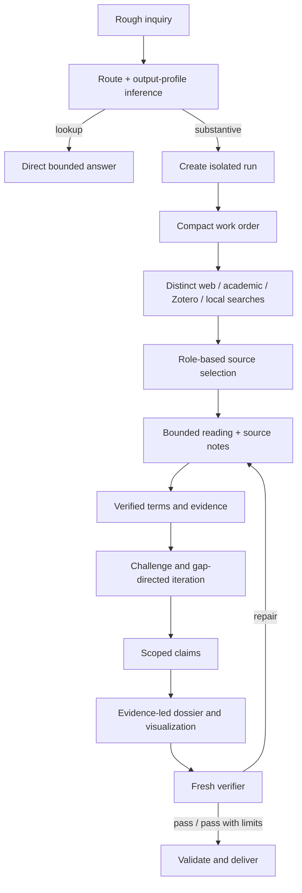

# Architecture

## Product boundary

MROS has one natural-language controller and one deterministic integrity layer.

The controller interprets a rough inquiry, chooses the route and output profile, selects source lanes, and carries research through to delivery. The integrity layer stores and validates searches, sources, exact terms, evidence, claims, state, and audit.

## Flow

## Semantic routes and output profiles

Routes control depth: lookup, close-read, brief, deep, and design. Output profiles control composition: source answer, research note, concept dossier, literature review, comparison, or design brief.

This separation matters. “Deep” alone does not tell the machine whether the user wants a chronology, a terminology dossier, a comparative matrix, or a design decision.

## Durable run boundary

Every substantive inquiry lives under `research/runs/<run-id>/`. The framework source and legacy root records are not modified during ordinary research.

V1.2 adds first-class query and term records. The run therefore preserves not only the final claims but how sources were found and which exact reference-specific formulations entered the dossier.

## Source and reading architecture

Search is broad but reading is selective. Sources are assigned roles rather than universal tiers. Access advances through metadata, abstract/description, bounded section/pages, and close reading. A source's role, access, reading status, and limitations are recorded independently.

## Distributed agency

The main Sonnet researcher owns route selection, source judgment, synthesis, and state. One bounded low-effort scout may map a search batch. One fresh Sonnet verifier may audit consequential outputs. Workers run sequentially; the system does not use a swarm.

## Validation boundary

Scripts validate record shape, duplicate IDs, query/source links, source/evidence/term/claim references, exact-term verification requirements, completion state, and audit status. They do not assert that an interpretation is intellectually correct. Live source checking and human evaluation remain necessary.
