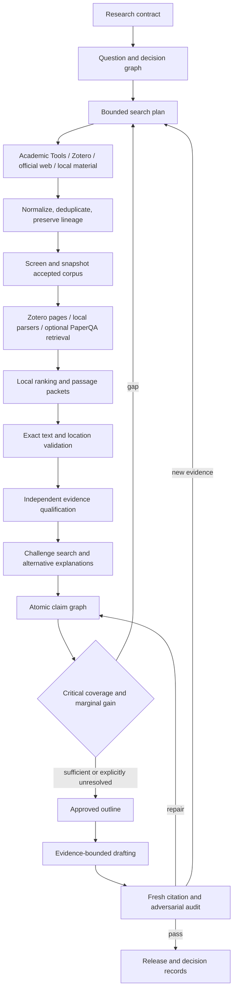

# Architecture

## Four planes

### Governance

Defines the research purpose, target decision, audience, genre, scope, exclusions, evidence requirements, budget, and human approval gates.

### Discovery and corpus

Routes searches to scholarly providers, Zotero, official web sources, archives, repositories, or local materials. It normalizes identifiers, preserves versions, records queries, screens candidates, and snapshots the accepted corpus.

### Evidence and argument

Retrieves bounded passages, reranks locally where useful, verifies exact text and location, qualifies evidence independently, seeks challenges, and builds atomic claims.

### Audit and translation

Checks citations and claim support, controls release wording, records omissions, and translates accepted research into user, design, technical, and evaluation decisions.

## Flow

## State boundaries

- Zotero owns bibliographic identity, attachments, human annotations, collections, and bibliography exports.
- Git owns questions, search history, evidence status, claims, generated text, decisions, audits, and event history.
- Claude sessions are disposable workers over bounded state.
- Scripts own exactness, referential integrity, hashing, and accounting.
