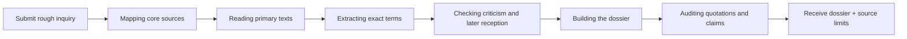
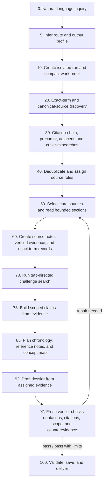

# Full process simulation: “Uncreative Writing” concept dossier

## The only user message

> Gather up a research note dossier around the concept “uncreative writing” with exact terms and wording and concepts introduced and used by references.

No slash command, template, phase name, or follow-up instruction is required.

## What the user sees



The system may show short progress lines, but the user does not operate the route.

## What the machine infers

| Field | Inferred value |
|---|---|
| Route | `deep` |
| Output profile | `concept-dossier` |
| Core requirements | exact wording, reference-by-reference terms, historical/conceptual map, full references |
| Source lanes | web + academic; Zotero only when useful and not excluded |
| Primary emphasis | name-giving and canonical texts |
| Critical emphasis | counterpositions, exclusions, later reception |
| Default budget | 4 bounded query batches; up to 40 candidates; roughly 8-18 selected sources; up to 8 core close reads; one scout and one verifier sequentially |
| Clarification | none; the request is sufficiently clear |

## Internal 0-100 flow



### 0-10 — Route and durable run

Within the first useful turn, Claude:

1. recognizes that this is not a lookup or ordinary summary;
2. selects `deep` + `concept-dossier`;
3. creates a unique directory such as:

```text
research/runs/uncreative-writing-20260719-a1b2/
```

4. writes the exact request to `request.md`;
5. initializes the run without reading framework schemas;
6. writes a short work order in `plan.md`;
7. immediately begins the first source search.

The work order contains only the inferred purpose, source roles, coverage slots, search strategies, and stop rule. It is not a user-facing form.

### 10-30 — Broad but structured discovery

The system runs distinct searches rather than many slight variations:

1. exact phrase and spelling variants;
2. canonical authors and primary works;
3. publisher, author, archive, syllabus, or institutional pages;
4. backward and forward citation chains;
5. precursors and adjacent concepts;
6. criticism and counterpositions;
7. later reception and pedagogy;
8. non-English variants only when useful.

Every executed search is recorded in `queries.jsonl`. Search results remain candidates, not evidence.

A bounded low-effort scout may map one batch. It returns candidates and gaps to the main researcher; it does not write the dossier.

### 30-45 — Source-role selection

Candidates are deduplicated and assigned functions:

```text
primary-core
primary-adjacent
scholarly-interpretation
critique
reception
context
discovery-only
```

Selection is based on role, directness, access, version, genre, relevance, methodological quality, and independence—not a universal source tier or citation count.

For this inquiry, the machine tries to establish a balanced field containing:

- texts that explicitly name or consolidate “Uncreative Writing”;
- adjacent conceptual-writing and appropriation formulations;
- historical and scholarly interpretation;
- substantial criticism and counterpositions;
- later reception, pedagogy, or transformation.

A missing role becomes an explicit gap, not an excuse to use a weak source.

### 45-65 — Selective close reading and exact terms

The system moves through the access ladder:

```text
metadata → abstract/description → bounded section/pages → close read
```

Only selected core sources receive close reading. For each core reference, the machine writes a compact note under `source-notes/` and records:

- the source's role;
- the movement of its argument;
- exact terms, definitions, distinctions, methods, or slogans;
- short uninterrupted quotations with locations;
- the difference between source wording and interpretation;
- access, edition, and attribution limits;
- relations to other references.

Each consequential formulation becomes a record in `terms.jsonl`. The linked evidence must contain an exact quotation reopened from a bounded source location and a verification method.

### 65-78 — Challenge and gap-directed iteration

Before settling the account, the system searches for:

- alternative chronology or attribution;
- different uses of the term;
- criticism of appropriation, authorship, institutions, race, gender, class, or pedagogy where relevant;
- source dependence and repeated citation chains;
- inaccessible or indirect primary evidence;
- later revisions or abandonment of the vocabulary.

It asks internally whether the new batch added a new primary source, exact term, contradiction, or substantially different interpretation. After two bounded low-gain searches, it stops and records the remaining gaps.

### 78-92 — Evidence-led synthesis

Only now does the machine plan the dossier. A default structure is:

1. scope and orientation;
2. chronology or formation map;
3. reference-by-reference notes with exact terms and wording;
4. relations and differences among formulations;
5. precursors and adjacent practices without retrospective absorption;
6. disputes and criticism;
7. later reception and transformation;
8. unresolved questions and source limits;
9. references;
10. a simple chronology or concept-map visualization.

Claims in `claims.jsonl` link to verified evidence and, where relevant, term records and counterevidence. The dossier is drafted from those records rather than from the search transcript.

### 92-100 — Independent audit and delivery

A fresh read-only verifier checks the most consequential claims and every exact term used in the dossier:

- quotation accuracy and location;
- whether the cited source supports the wording;
- primary versus secondary evidence;
- overclaims of coinage, origin, influence, or consensus;
- suppressed criticism;
- source dependence;
- indirect or inaccessible evidence;
- generated statements presented as evidence.

Blocking findings reopen reading or searching. When the audit passes or passes with explicit limits, MROS sets the run to `complete` and runs `mros run-validate`.

The user receives:

- the clear research-note dossier;
- the visualization when useful;
- full references;
- a short note on access and unresolved limits;
- the durable run path for inspection or continuation.

## Durable run at completion

```text
research/runs/uncreative-writing-20260719-a1b2/
├── request.md             # exact user inquiry
├── state.yaml             # route, profile, stage, budget, progress, next action
├── plan.md                # compact internal work order
├── queries.jsonl          # exact searches and selected source IDs
├── sources.jsonl          # candidates, roles, access, reading status, selection reasons
├── source-notes/          # compact close-reading notes for core references
├── terms.jsonl            # exact reference-specific terminology and wording
├── evidence.jsonl         # quotations/paraphrases, locations, verification, limits
├── claims.jsonl           # scoped supported, qualified, contested, or unresolved claims
├── visualization.md       # chronology or concept map when useful
├── dossier.md             # requested research note dossier
└── audit.yaml             # independent checks, findings, and source limits
```

## If the Claude subscription or context limit interrupts the run

The system updates `state.yaml` after meaningful batches. A fresh Local Code session sees the newest active run through the session hook. The user can simply say:

> Continue the Uncreative Writing research.

Claude resumes the stored next action rather than repeating discovery or asking for phase commands.

## Completion gates

A concept dossier cannot be marked complete unless:

- at least one selected `primary-core` source exists;
- web/academic searches are logged when those lanes were used;
- exact term records exist;
- every term links to verified exact-quotation evidence;
- consequential claims link to verified evidence;
- the dossier is non-empty;
- the audit passes or passes with explicit limits.

These gates protect evidence integrity without making the user operate a formal workflow.
